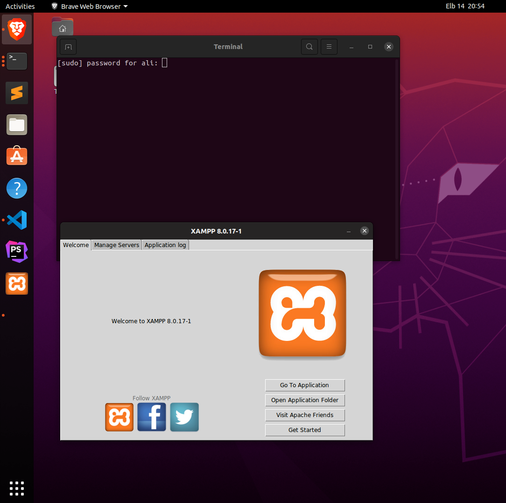

## How to create Xampp shortcut in Ubuntu's Start Menu--DASH

 Recently, I tried to install Xampp on Ubuntu, after installing successfully, I recognized that Xampp does not actually show up on Ubuntu start menu,finaly i found the solution to create Xampp shortcut on Start Menu.

### 1. Open terminal:
  
    sudo gedit /usr/share/applications/XAMPP.desktop

### 2. Paste the following     
     
     [Desktop Entry]
     Encoding=UTF-8
     Name=XAMPP Control Panel
     Comment=Start and Stop XAMPP
     Exec=sudo /opt/lampp/manager-linux-x64.run
     Icon=/opt/lampp/htdocs/favicon.ico
     Categories=Application
     Type=Application
     Terminal=true
     
